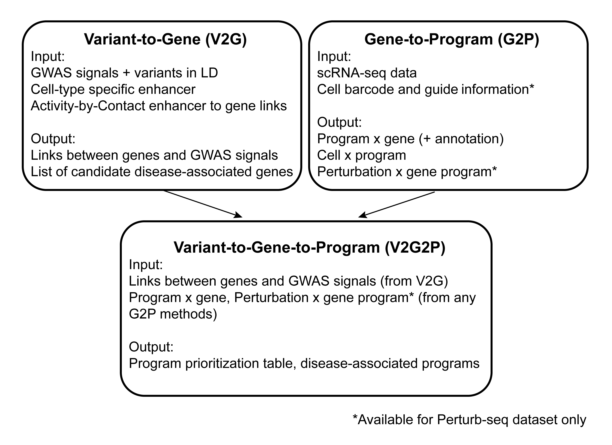

# Variant-to-Gene-to-Program (V2G2P) Approach

## Description

A pipeline to connect GWAS variants to genes to disease-associate gene programs. This pipeline uses snakemake and cNMF from Kotliar et al. The V2G2P approach could be applied to any GWAS studies with the right cell type(s). 

### Overview of the V2G2P pipeline
The V2G2P approach has three components: V2G, G2P, and V2G2P enrichment test. Each each coded to work as a stand-alone pipeline. Together these three components are essential for V2G2P. Below is a overview of the relations among the three steps:
 


## Citation


## Usage
### Step 1: Clone this github repository

### Step 2: Install conda environment
Install Snakemake and conda environment using conda:

```bash
conda env create -f conda_env/cnmf_env.yml
conda env create -f conda_env/cnmf_analysis_R.yml
```
cnmf_env contains snakemake. If you do not have snakemake installed already, you can activate the environment via `conda activate cnmf_env`, then run the pipeline.


### Step 3: Gather all input data
#### Necessary inputs:
Config file slots:
| field         | meaning                   |
|---------------|---------------------------|
| total_workers | Number of processes to run in parallel |
| seed | A number to set seed for reproducibility |
| num_runs | Number of NMF run (recommend 100 for the actual data analysis, and 10 for testing the pipeline) |
| run_per_worker | Number of run assign to each process/worker to run in series (make sure that num_runs = total_workers * run_per_worker)|
| k | Number of components to factorize |
| thresholds | Threshold for filtering outlier components, 2 for no filtering, recommend 0.2 |
| analysisDir | Directory for numeric result outputs |
| figDir | Directory for figure outputs |
| dataDir | If using 10X scRNA-seq matrix as input, the directory with 10X files (file names must be features.tsv.gz, barcodes.tsv.gz, matrix.mtx.gz). This can be left blank if supplying the input matrix as an h5ad file. |
| input_h5ad_mtxDir | Path to input matrix in h5ad format. Please put the h5ad file in config["analysisDir"]/data/ folder. The snakemake pipeline will look for the input h5ad file from there. The file name must be the same as config["sampleName"] (e.g. config["analysisDir"]/data/{sample}.raw.h5ad, if you want to filter the data (remove noncoding genes, very lowly expressed genes, and cells with little genes detected) using this pipeline, please name the input file to '{sample}.raw.h5ad'. If not, use '{sample}.h5ad' to skip filtering).  Leave this blank if supplying the input matrix in other formats. |
| scratchDir | Directory for cNMF pipeline to store temporary files |
| barcodeDir | (Necessary for Perturb-seq, optional for scRNA-seq without perturbation) Path to cell barcode / identifier tsv file, the sequence of appearance should be the same as in the input cell x gene matrix, and it must contain columns named "Gene" and "Guide" if doing Perturb-seq |
| motif_meme | MEME file for matching sequence to motifs |
| fasta_file | Fasta file to find sequences based on coordinates |
| promoter_fimo_formatted | (Optional) Path to promoter motif matches from FIMO output |
| enhancer_fimo_formatted | (Optional) Path to ABC enhancer motif matches from FIMO output | 
| ABC_enhancers | Coordinates for ABC enhancers for the approapriate cell type |
| PoPS_raw_featureDir (not used in this version) | Directory for storing feature txt files (one row per gene in ENSGID) for PoPS input |
| PoPS_gene_annotation_path (not used in this version) | Gene annotation file for PoPS pipeline |
| magma_dir (not used in this version) | Path to MAGMA results for PoPS pipeline input |
| magma_prefix (not used in this version) | Desired magma_prefix for pointing to files in magma_dir |
| PoPS_control_features (not used in this version) | A list of features that serves as controls for the PoPS pipeline |
| PoPS_features_metadata_path (not used in this version) | PoPS external feature's annotation |
| pipelineDir (not used in this version) | The directory to this snakemake pipeline |
| K_spectra_threshold_table (Optional) | Table used for specifying spectra cut-off for each K tested in the pipeline. default: 0.2 for all K |
| GWAS_traits | GWAS traits to conduct V2G2P |
| sampleName | Name for this run |
| cNMF_gene_selection | "all_genes" for using all expressed genes as input, "top3000VariableGenes" for using the top 3,000 most variable genes as an input, the number of top variable genes can be adjusted by the user, e.g. "top2000VariableGenes" for using the top 2,000 most variable genes. If using "all_genes", the user must specify the gene names in a .txt file in one column, stored at config["analysisDir"]/data/ with file name: {sample}.h5ad.all.genes.txt |
| Perturb-seq | True for an Perturb-seq experiment. The pipeline will generate additional results based on comparison between perturbation and control. False for any scRNA-seq experiment. |
| num_Genes_per_MAST_runGroup | (Optional, required for Perturb-seq datasets) Number of perturbations to be tested against control in one job submission. This is to speed up the code. Recommend 20. |
| numCtrls_for_MAST | (Optional, required for Perturb-seq datasets) Number of (randomly selected) controls to use in statstical test. Recommend 5000 or less for speed. |
| num_cells | Expected number of cells in the input dataset. It doesn't have to be exact. This is for optimizing memory requests and job scheduling. |

Note: please keep all optional items in the config file, even if it points to a non-existing path. The snakemake pipeline might return an error if they are not there. 


### Step 4: Run the pipeline
```sh
conda activate cnmf_env
snakemake -n --configfile /path/to/config.json --quiet ## always recommend doing a dry run
```

Execute the workflow locally via
```sh
snakemake --configfile /path/to/config.json
```
Please see the log.sh file in this github page for more examples.

For more snakemake usage and configuration, please visit snakemake documentation page.


## Outputs
The output files can be found in the folders specified in analysisDir and figDir fields in the config file.

### Analysis files (in analysisDir)
#### Summary output for choosing the number of components
Output can be found in config['analysisDir']/{cNMF\_gene\_selection}/{sampleName}/acrossK/

#### Outputs for each model (each choice of # components)
Output can be found in config['analysisDir']/{cNMF\_gene\_selection}/{sampleName}/K\*/threshold\_\*/
##### Program z-score coefficient
topic.zscore\_k\_\*.dt\_\*.txt
```
1	2	3	4	5	6	7	8	9	10	11	12	13	14	15	16	17	18	19	20	21	22	23	24	25	26	27	28	29	30	31	32	33	34	35	36	37	38	39	40	41	42	43	44	45	46	47	48	49	50	51	52	53	54	55	56	57	58	59	60	61	62	63	64	65	66	67	68	69	70	71	72	73	74	75	76	77	78	79	80	81	82	83	84	85	86	87	88	89	90
ENSG00000237491	3.6257507558702e-05	-0.000235942153872956	-0.000193839434908331	-0.000540485719839952	0.000552241385286034	-0.000201390791494423	8.75377887444021e-05	-8.26346157936536e-05	0.000256759855447459	-0.000339609165657141	2.97896083950046e-05	0.000687455576483113	-0.000151702242624839	0.000327691107098052	-0.000204158001546107	-0.000289447771145073	-0.000196239011791769	0.00154040438524839	6.64307968052208e-05	-0.000210747623307798	3.91082396297854e-05	3.28090173953066e-05	-6.82762061474105e-05	0.000346680760437194	-0.000434505149419527	3.07134546629071e-05	-4.66919527344807e-05	-9.84821214904951e-05	-0.000310237477830714	-0.000638909219613249	-0.000449261618986614	0.00236169789924395	-2.99388207930532e-05	0.000112124250801755	-0.000205873107158084	0.00118396446801699	-8.04675518574793e-05	-1.08022761998793e-06	-0.00032657718959049	0.000879090403025747	0.000711604342284466	4.58589731592956e-05	7.81209925208869e-05	-9.68548257900938e-05	-0.000261418751767653	-6.97565760230801e-05	-0.000364045128671641	-9.14872433022581e-05	0.00301861664150378	0.000487734728605933	0.000144017860764802	0.000204245920744823	-0.00028592571008198	0.000114994441178753	2.33365636877884e-05	0.00179981045907693	-0.000127734743936086	-0.000473005106126543	-0.000286177991598109	-0.000218404922934822	-0.000225282612194657	0.000522523214578263	0.000170376906142333	-0.00035889738665674	-0.0003926501366325	0.000275056020755212	-0.000486186756372187	0.000238462372482112	0.000175202698436504	-0.000229673808428174	-0.000700905188911717	0.000144637250219059	9.12354369735676e-05	-8.40999629381241e-05	-0.000118252777148798	0.000172813493783571	8.74358760916756e-05	0.000404696722921066	0.000132028345127144	9.64011060392208e-05	0.000227205136515923	-0.000243261558681986	-0.000214146639495842	-0.000362649397197894	-5.11403787774615e-05	0.000740349657857787	7.65313173554984e-05	-0.000274844444217957	-0.000381361969318532	-0.000177794399546524
ENSG00000228794	0.0003830319516136	0.000355691338179841	-1.05950306027163e-05	0.000127820490880465	-7.31291821168389e-05	-1.10277689952049e-05	0.000109005307931079	0.000518538576359656	0.000485105320360724	2.27368424675288e-05	-0.000230314274890742	-0.000150283422291734	-0.00010529458664589	7.70193256240283e-05	-2.8272520097087e-06	-0.000565786025411416	-8.75795335952311e-05	0.000222131397817275	4.08464600104762e-06	-8.84891928573324e-05	0.000129675002348178	0.000330994369629849	-3.49911315134635e-05	7.698047595147e-05	-0.000207698872887955	-0.000365335395047771	-0.000358755651660673	-0.000127650412950376	-0.000180414420617124	-0.00119329814081874	3.43609322673543e-05	-0.000797526438995552	-0.000148774288156748	0.000354855300060872	-0.000227170502101143	-0.000225235408025414	-0.000199515103928078	0.000238588352532944	3.37933029526634e-05	0.000126233561182807	-0.000652257621179978	0.000137670808631218	-5.25055940520106e-05	7.79270777152396e-06	-0.000290050479113386	-0.000253159097195554	-0.000156294235706472	0.000110566235414443	6.04551701827383e-05	0.00204524774593777	1.76794497794074e-05	0.000183176421857839	-0.000156802463557547	-0.000267998745215926	-7.89076033040562e-05	0.000544368144273017	-0.000111469393298824	-0.000328172768008264	7.83562504370004e-05	2.2862276787585e-05	5.58245262902203e-05	-0.000141937166498772	-9.16882192704192e-05	-2.50244445672456e-05	-0.000333419229756242	0.000571927351385279	-0.00109361661296798	-3.85078624884629e-06	2.45876064353904e-05	-4.28323617580336e-06	-6.44043276606002e-05	6.96526886733287e-05	-5.13316341023035e-05	0.000101058711721449	0.000447087628331816	-9.54830431057188e-05	-9.84285278180958e-05	0.000382407144128984	-6.47913289005252e-05	0.000154304069623889	0.000278680354427714	9.02708817726633e-05	-4.77518643121104e-05	2.22121399107156e-05	-0.000100486230733875	-0.000155911349936267	9.58525674405382e-05	9.44644886135765e-05	-0.000188089365111741	6.06376279784062e-05
ENSG00000188976	0.000350524557558168	0.00140440015571758	0.000283150852501125	-0.000197248748171782	-0.00037510091461753	-0.000105836646173528	-0.000286203456393242	-0.000239557697032912	-0.000248794066914784	-0.0012257052578368	-0.000988751089409712	-0.000305878236350561	-0.000717408393449572	-0.00135462020016997	0.000218844657463507	-5.69693856103151e-06	0.000292575981933451	0.000802881308037214	-0.000463570681085942	-0.000546871152910976	0.000428807831608	-0.000332801001901376	-0.000363867768313229	1.26751236270919e-05	-0.000613844522555879	0.000134192538576475	-0.000151844697479961	-0.000517247366515382	-0.000979696735403971	-0.00231643290337771	-0.000411060807246556	-0.000829614535615998	-0.000463595357467624	0.000211114060032754	-0.000459602973957588	-0.000385539380306828	3.26837996307634e-05	4.90582823595978e-05	-0.000275485781302146	-0.000913505079533773	-0.000389164082050203	9.33356980316987e-05	0.000114413872875212	0.000486612202137258	0.000192577452022132	8.01864355453836e-06	-0.000516070978454305	0.000643960764244882	-0.000219556345385713	0.00536865311335595	-0.000535178856867003	-0.000584067084769768	-0.000414121189304587	-0.000326010941366969	-0.00045331624134027	0.00104428295695003	-7.06825973624717e-05	-0.000582497714918622	0.00083933424178752	-0.000160149329772988	9.39739949391142e-05	-0.000650835878212008	-0.000184777484265797	-0.000294350147880196	-0.000596363795966926	0.00131283875271719	-0.00155652921516448	-0.000717653881449108	-0.000204400568012354	-0.000421267000410629	-0.000156226991563029	0.000141473267184267	-0.000433393032937874	-0.00018681415810335	0.00108084886240902	-0.000508499883366756	-0.000399452289109583	0.00101750008745467	0.000629843969832574	-5.40811730509978e-05	-0.000608716271934908	-0.000141709694152402	0.00128779179684845	0.000729006620348706	3.08031909026722e-05	0.000257931810362615	-0.000243090135199539	0.000937109035270549	-0.000497197904106814	6.54297394566199e-06

Column description:
Each column is a program. Each row is a gene.
```

##### Summary of Gene Programs
\*\_ProgramSummary\_k\_\*.dt\_\*.xlsx
```
ProgramID	MaxBatchCorrelation	nSigPerturbationsProgramUp	nSigPerturbationsProgramDown	nSigMotifsPromoter	nSigMotifsEnhancer	ProgramGenesZScoreCoefficientTop10	ProgramGenesTPMCoefficientTop10	ProgramGenesMedianSpectraTop10	ProgramGenesMedianSpectraZScoreTop10	ProgramGenesMotifsPromoter	ProgramGenesMotifsEnhancer	ProgramGenesZScoreCoefficientGOTermsTop10	ProgramGenesMedianSpectraZScoreGOTermsTop10
K90_1	0.009690118	43	105	5		HMMR,DLGAP5,HMGB2,CDC20,MIR17HG,ENSG00000260708,CKS2,CCNB2,CCNB1	COX3,COX2,ATP6,CYTB,ND3,EEF1A1,COX1,RPLP1,ND4	ENSG00000260708,ZNF280B,MIR17HG,SOX4,TOB2,ENSG00000261526,DLGAP5,HMGB2,TMF1	TOB2,ZNF280B,MIR17HG,C21orf91,PIK3R1,SOX4,REST,RAB22A,NXF1	CEBPZ,NFYB,FOXI1,NFYC,NFYA		BP:GO:0051301:cell division,CC:GO:0000779:condensed chromosome, centromeric region,CC:GO:0000793:condensed chromosome,BP:GO:0000070:mitotic sister chromatid segregation,BP:GO:0000819:sister chromatid segregation,BP:GO:0098813:nuclear chromosome segregation,BP:GO:0140014:mitotic nuclear division,CC:GO:0005819:spindle,CC:GO:0000776:kinetochore,CC:GO:0000775:chromosome, centromeric region	MF:GO:0140110:transcription regulator activity,BP:GO:0006366:transcription by RNA polymerase II,CC:GO:0000779:condensed chromosome, centromeric region,CC:GO:0000777:condensed chromosome kinetochore,CC:GO:0044451:nucleoplasm part,BP:GO:0051301:cell division,BP:GO:0006357:regulation of transcription by RNA polymerase II,CC:GO:0000775:chromosome, centromeric region,CC:GO:1990234:transferase complex,CC:GO:0000776:kinetochore
K90_2	0.065779043	27	527	10		PITX1,SRSF5,SRSF6,NEFH,SRSF7,HIC2,TOMM40,SLC30A1,ZFP36L2	COX2,COX3,ATP6,ND4,COX1,CYTB,ND1,RPS2,ND3	PITX1,SRSF5,SRSF6,SRSF7,NEFH,TOMM40,HIC2,KCNH2,ZFP36L2	NEFH,NRARP,SRSF7,HIC2,ELL,PITX1,TOMM40,PPP1R37,SRSF5	AP2D,ZIC4,ZF64A,NR1H4,THAP1,SP1,ZN320,RFX1,EGR4,AP2B		CC:GO:0030687:preribosome, large subunit precursor,CC:GO:0030684:preribosome,BP:GO:0043484:regulation of RNA splicing,CC:GO:0016607:nuclear speck,CC:GO:0044452:nucleolar part,BP:GO:0000381:regulation of alternative mRNA splicing, via spliceosome,BP:GO:0042254:ribosome biogenesis,BP:GO:0050684:regulation of mRNA processing,BP:GO:0048024:regulation of mRNA splicing, via spliceosome,BP:GO:1903311:regulation of mRNA metabolic process	MF:GO:0003723:RNA binding,BP:GO:0006405:RNA export from nucleus,BP:GO:0051254:positive regulation of RNA metabolic process,BP:GO:0071166:ribonucleoprotein complex localization,BP:GO:0071426:ribonucleoprotein complex export from nucleus,BP:GO:0045935:positive regulation of nucleobase-containing compound metabolic process,BP:GO:0051168:nuclear export,BP:GO:1902680:positive regulation of RNA biosynthetic process,BP:GO:1903508:positive regulation of nucleic acid-templated transcription,BP:GO:0006403:RNA localization
K90_3	0.059547855	15	612			TFRC,PICALM,NBAS,PIK3CB,OPA1,PCNT,LMNB1,PRKDC,MACF1	COX3,ATP6,COX2,ND4,EEF1A1,COX1,NPM1,CYTB,NCL	TFRC,PICALM,OPA1,NBAS,MACF1,PIK3CB,PCNT,LMNB1,TOP2B	OSBPL3,ZNF318,PCNT,ZNF217,SYNRG,LMNB1,DENND4C,PPP6R3,ZFX			BP:GO:0051301:cell division,MF:GO:0045296:cadherin binding,MF:GO:0050839:cell adhesion molecule binding,BP:GO:0051052:regulation of DNA metabolic process,MF:GO:0008092:cytoskeletal protein binding,CC:GO:0015629:actin cytoskeleton,MF:GO:0003729:mRNA binding,CC:GO:0099080:supramolecular complex,CC:GO:0099081:supramolecular polymer,CC:GO:0005925:focal adhesion	MF:GO:0003723:RNA binding,MF:GO:0000166:nucleotide binding,MF:GO:1901265:nucleoside phosphate binding,MF:GO:0005524:ATP binding,MF:GO:0032559:adenyl ribonucleotide binding,MF:GO:0030554:adenyl nucleotide binding,MF:GO:0035639:purine ribonucleoside triphosphate binding,MF:GO:0032553:ribonucleotide binding,MF:GO:0032555:purine ribonucleotide binding,MF:GO:0017076:purine nucleotide binding

Column description:
ProgramID: Program identifier
MaxBatchCorrelation: Maximum Pearson correlation with batch
nSigPerturbationsProgramUp: Number of significant perturbations that upregulates the program
nSigPerturbationsProgramDown: Number of significant perturbations that downregulates the program
nSigMotifsPromoter: Number of transcription factor motifs enriched at top 300 gene's promoter (top 300 genes ranked by z-score coefficient)
nSigMotifsEnhancer: Number of transcription factor motifs enriched at top 300 gene's ABC linked enhancers (top 300 genes ranked by z-score coefficient)
ProgramGenesZScoreCoefficientTop10: Top 10 gene names, ranked by z-score coefficient from cNMF
ProgramGenesTPMCoefficientTop10: Top 10 gene names, ranked by TPM from cNMF
ProgramGenesMedianSpectraTop10: Top 10 gene names, ranked by raw weights from cNMF
ProgramGenesMedianSpectraZScoreTop10: Top 10 gene names, ranked by raw weight's z-score for each gene across programs
ProgramGenesMotifsPromoter: Transcription factor motifs enriched at top 300 gene's promoter (top 300 genes ranked by z-score coefficient)
ProgramGenesMotifsEnhancer: Transcription factor motifs enriched at top 300 gene's ABC linked enhancers (top 300 genes ranked by z-score coefficient)
ProgramGenesZScoreCoefficientGOTermsTop10: Top 10 gene ontology terms enriched for top 300 genes ranked by z-score coefficient
ProgramGenesMedianSpectraZScoreGOTermsTop10: Top 10 gene ontology terms enriched for top 300 genes ranked by raw weight (or called median spectra from cNMF)
```

##### Raw weight for genes in each program
median.spectra.zscore.df\_k\_\*.dt\_\*/.txt

##### Promoter/Enhancer motif enrichment
{enhancer, promoter}.topic.top.300.zscore.gene\_motif.count.ttest.enrichment\_motif.thr.{pval1e-4, pval1e-6, qval0.1}\_k\_\*.dt\_*.txt

##### Gene ontology term and gene set enrichment analysis
clusterProfiler\_GeneRankingType{zscore, raw, median\_spectra, median\_spectra\_zscore}\_EnrichmentType{ByWeightGSEA, GOEnrichment, GSEA, PosGenesGOEnrichment}.txt

##### Program and sample Pearson correlation
sample.batch.correction.mtx.txt

##### Summary of variance explained by programs
summary.varianceExplained.df.txt

##### Variance explained by each program
metrics.varianceExplained.df.txt


#### Perturb-seq outputs (The pipeline will generate these files only if "Perturb-seq" in config file is set to True:
##### Program Expression Changes by MAST Package:
*\_MAST\_DEtopics.txt
```
primerid	Pr(>Chisq)	coef	ci.hi	ci.lo	fdr	perturbation	zlm.model.name	fdr.across.ptb
topic_1	0.931958981499932	-0.00308004078521135	0.0570387818054911	-0.0631988633759138	0.997587143723284	A1BG	batch.correction	0.980597200884276
topic_10	0.997587143723284	0.00216003169008006	0.0715983146968009	-0.0672782513166408	0.997587143723284	A1BG	batch.correction	0.999373860636769
topic_11	0.996904491792907	-6.48785292078902e-06	0.0407059273499904	-0.040718903055832	0.997587143723284	A1BG	batch.correction	0.99916248171282
topic_12	0.938744741036869	0.00810003101565848	0.0544634189392725	-0.0382633569079555	0.997587143723284	A1BG	batch.correction	0.982593736237456
topic_13	0.0766707475946088	-0.0661311794734254	-0.00293861544807195	-0.129323743498779	0.33755308978221	A1BG	batch.correction	0.390958645335121
topic_14	0.610995278682664	0.0246987961275237	0.091452821024267	-0.0420552287692196	0.945173197958634	A1BG	batch.correction	0.867881082549678

Column description:
primerid: Program name
Pr(>Chisq): p-value
coef: Fold change (log2)
ci.hi: Confidence interval (upper bound)
ci.lo: Confidence interval (lower bound)
fdr: FDR across k programs for each gene
perturbation: Perturbed gene name
zlm.model.name: Name of the model fit to the data before statistical test. Supplied from workflow/scripts/MAST_model_formulas.txt (Default: ~condition + lane)
fdr.across.ptb: FDR across k programs and all genes
```

#### V2G2P program prioritization outputs
Outputs will be in config['analysisDir']/{cNMF\_gene\_selection}/{sampleName}/K\*/threshold\_\*/program\_prioritization\_{GenomeWide, GWASWide}/{GWASTrait}/

##### Program prioritization summary table
*.program\_prioritization.txt

##### V2G2P gene list
Note that if "Perturb-seq" in the config file is set to "False", there will only be "ProgramGene" output. Regulator information requires perturbation
significant{LinkedGenes, ProgramGene, Regulator}.formatted.df.txt


### Figures (in figDir)


